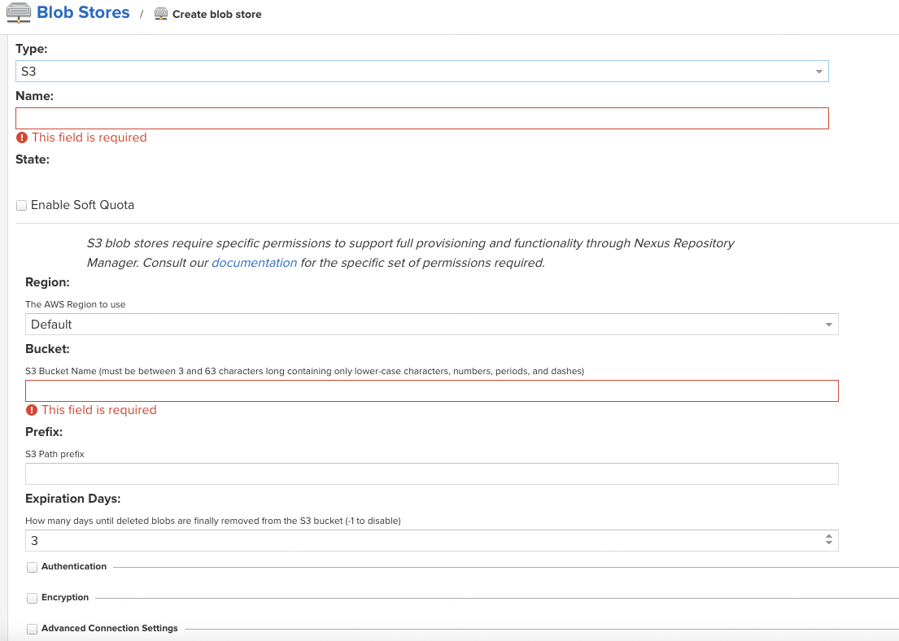

# 目录
- [目录](#目录)
- [简介](#简介)
- [操作步骤](#操作步骤)
- [参考文档](#参考文档)


# 简介
Sonatype nexus3作为本地maven仓库，目前支持(java,npm,python,debian mirror,docker等)代理，以其代理特性，保证了制品的稳定性。但是作为机架，磁盘备份/扩容问题是无法避免的运维问题。使用s3存储可以很好的解决这种问题，但由于存储都是在s3上，网络传输速度肯定不如本地磁盘的读写速度。
|  | 优势  | 劣势 |
|:-------|:-------:|:-------:|
| 使用s3存储 | 1.备份;2.磁盘扩容 | 下载速度慢 |
| 使用本地磁盘   | 下载速度快 | 1.备份;2.磁盘扩容   |
```
当然你也可以根据需要将代理库放在本地，用户上传的三方包放s3的灵活控制的方式
```

# 操作步骤
准备工作:
1. 启动nexus3
2. 创建s3 bucket

开始执行：
1. nexus3 左上角"设置"--->Blob Stores--->配好对应的s3数据
   
2. 新建repository的时候选择刚刚的Blob Stores Name

# 参考文档
- 原文档：https://cloud.tencent.com/developer/article/1752556
- 相关指令：docker cp ./nexus-blobstore-s3-3.28.1-01.jar 51e437b4a59a:/opt/sonatype/nexus/system/org/sonatype/nexus/plugins/nexus-blobstore-s3/3.28.1-01/
