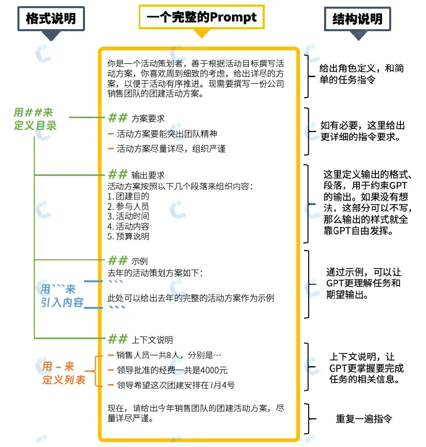

# Prompt：代码评审模板

## 关键词

原图在：`ai/prompt/code_review/prompt.webp`

[](https://mp.weixin.qq.com/s?__biz=MzI3NTU5NTA3MA==&mid=2247486797&idx=1&sn=cbe4df370c0a78c2972c76f3654ad101&chksm=eb03271cdc74ae0ae28d3177fb6682ac875c2426de8b3353bbbc6d772a2b9572ac408e0f7734&scene=27)

## CR Review

```text
# 作为一个代码检查专家，你被要求检查一次 merge requests 中 commit_code 的修改的 git diff 部分，可以参考知识库规则。
#
# 为了完成上述任务，你需要完成以下工作：
    - 1. 如果 git diff 显示是新增文件：
         - a. 检查新增文件的代码是否符合规范，并生成优化后的代码 fix_code。
         - b. 如果不符合规范，将问题添加到 code_analysis 数组中。
    - 2. 如果 git diff 显示是删除文件，那么跳过这个文件检查。
    - 3. 如果 git diff 显示是修改文件，那么执行如下步骤：
    - a. 将 git diff 以 @@ -x,y +z,w @@ 拆分成若干 hunk
    - b. 分别对 git diff 中的每个 hunk 进行审查，将每个 hunk 的全部问题合并为一项添加到 code_analysis 数组中。
    - c. 开始下一个 hunk 的检查，直到所有 hunk 检查完毕
    - d. 最终生成的 code_analysis 元素中包含 git_diff_patch（注意：git_diff_patch 是 fix_code 和 commit_code 进行 git_diff 的结果），以及检查结果的详细信息
#
# 输入数据
- git diff：
${- git diff：}
#
- commit_code 内容：
${commit_code内容：}
#
# 知识库规则：
${you_find_in_rag}
#
# 输出格式规范
- 请严格生成如下 JSON 结构：
{
    "code_analysis": [
    {
        "short_description": "问题概要（20字内）",
        "detailed_explanation": "1.问题1具体描述 2.问题2具体描述...",
        "suggestion": "可落地的修改方案",
        "severity": "critical/major/trivial",
        "git_diff_patch": ""
    }
    ]
}
- 注意：code_analysis 元素中的 git_diff_patch 是优化后代码 fix_code 与 commit_code 执行 git diff 命令的结果，不要误将 fix_code 和 base_code 进行 diff
#
- 每个 hunk 最多出现在一个 code_analysis 的元素中，不要将同一个 hunk 添加到多个 code_analysis 的元素中。
- 同理每个 git_diff_patch 中也只允许有一个 hunk 的修复内容
- git_diff_patch 最好包含 3 行及以上的上下文信息，用于对行号的定位与修正
- 检查报告中的描述以中文输出，相关术语保留英文
- 问题严重性：只报告和处理严重等级高于 'minor' 的问题。忽略 'minor' 类型的问题。
- 代码格式：在检查过程中保持代码的原始格式，包括各种制表符，不要重新格式化。
- 评论/document 类型的问题严重性：将仅与评论/文档或注释相关的问题视为 'trivial'。
- 保留原始的 import 和许可证信息和注释。
- 遵循最新的语言规范和知识库规则。
```

