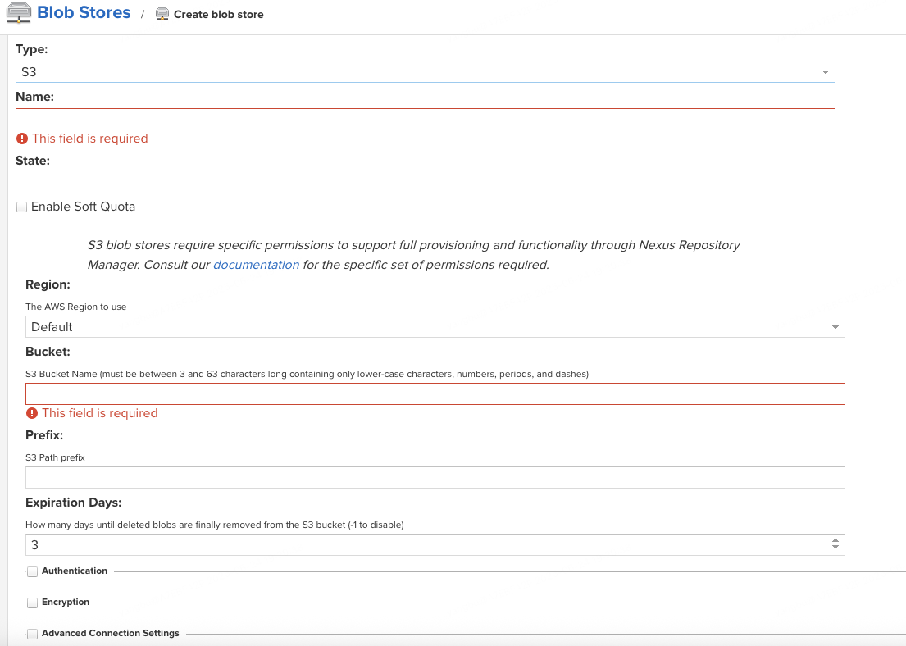

# Nexus：使用 S3 存储 Blob 数据

## 背景

Sonatype Nexus3 作为本地制品仓库，支持（Java、npm、Python、Debian mirror、Docker 等）代理。由于代理缓存/上传制品会占用大量磁盘，磁盘备份与扩容是常见运维问题。

使用 S3 存储 Blob 数据的一个典型取舍如下：

| 方案 | 优势 | 劣势 |
|---|---|---|
| 使用 S3 存储 | 备份更方便；扩容更容易 | 下载速度可能更慢 |
| 使用本地磁盘 | 下载速度更快 | 备份与扩容成本更高 |

也可以采用混合策略：把代理库放本地、用户上传的第三方包放 S3。

## 操作步骤

### 准备工作

1. 启动 Nexus3
2. 创建 S3 bucket

### 开始执行

1. Nexus3 左上角「设置」→ Blob Stores → 配置对应的 S3
   
2. 新建 repository 时选择对应的 Blob Stores Name

## 参考

- 原文档：`https://cloud.tencent.com/developer/article/1752556`
- 相关指令示例：

```bash
docker cp ./nexus-blobstore-s3-3.28.1-01.jar 51e437b4a59a:/opt/sonatype/nexus/system/org/sonatype/nexus/plugins/nexus-blobstore-s3/3.28.1-01/
```

